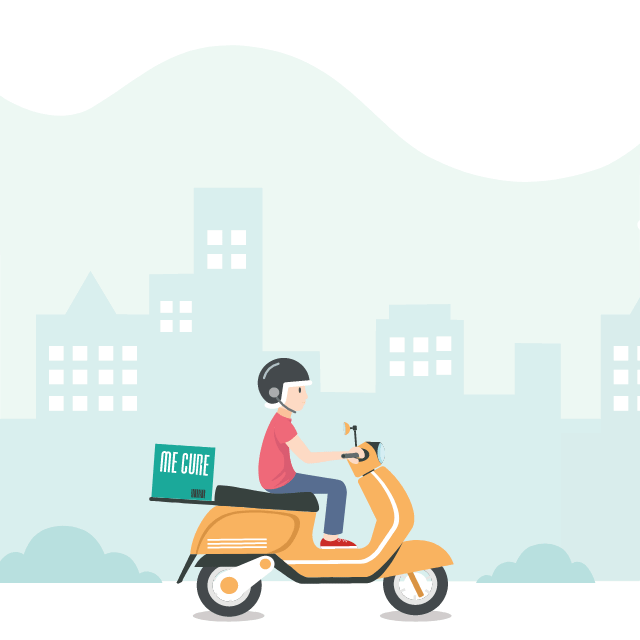

<h1 align="center">
  
</h1>

<h2 style="color:red" align="center"> GoEat </h3>
<h3 align="center">
  Express Application for a Food Delivery App 
</h3>

<p align="center">
  

  <a href="https://www.linkedin.com/in/laurabeatris/">
    
  </a>

  

  <a href="https://github.com/LauraBeatris/goeat-api/stargazers">
    
  </a>
</p>

<p align="center">
  <a href="#rocket-about-the-project">About the project</a>&nbsp;&nbsp;&nbsp;|&nbsp;&nbsp;&nbsp;
  <a href="#ballot_box_with_check-goals">Goals</a>&nbsp;&nbsp;&nbsp;|&nbsp;&nbsp;&nbsp;
  <a href="#checkered_flag-installation">Installation</a>&nbsp;&nbsp;&nbsp;|&nbsp;&nbsp;&nbsp;
  <a href="#incoming_envelope-routes">Routes</a>&nbsp;&nbsp;&nbsp;|&nbsp;&nbsp;&nbsp;
  <a href="#memo-licence">Licence</a>
</p>

<hr>

## :rocket: About the project
GoEat is a food delivery application. There's two types of users - Provider or Customer. Providers can create restaurants and open then in any hours,
updating the restaurants with new foods and getting notifications of new orders or cancelled orders. 

The user has access of the open restaurants and is able to search for establishments in a specific region. 

<hr>

## :ballot_box_with_check: Goals
Fast and clean application for providers and users who want to enjoy a good delivery food service

<hr>

## :checkered_flag: Installation 
First, you need to install docker and docker-compose on your machine in order to use the services. Create a .env similar
to the .env.example in the files above. 
<br>
To run the containers 

```
sudo docker-compose up
```

Check if the containers are running

```
sudo docker ps
```

<br>

Now, to install the dependencies

```
yarn install
```

To start the application 
```
  // Development mode - .env.development
  yarn dev 
  // Production mode - .env
  yarn start
  
```
To run the queue for the mail job
```
  // Development mode - .env.development
  yarn queue-dev
  // Production mode - .env
  yarn queue
```

## :incoming_envelope: Routes
- **User Resources**:

- **Provider Resources**:

- **Sessions Resources**:

- **Appointment Resources**:

- **Restaurant Resources**:

- **Files Resources**:

- **Dashboard Resources**:

- **Available Resources**:

- **Notifications Resources**:

- **Schedule Resources**:

- **Food Resources**:

<hr>

## Status Codes

Goeat returns the following status codes in its API:

| Status Code | Description |
| :--- | :--- |
| 200 | `OK` |
| 201 | `CREATED` |
| 400 | `BAD REQUEST` |
| 404 | `NOT FOUND` |
| 500 | `INTERNAL SERVER ERROR` |

## :memo: Licence

MIT Licence. See the file [LICENSE](LICENSE.md) for more details.

---

Made with ♥ by Laura :wave: [See my linkedin!](https://www.linkedin.com/in/laurabeatris/)
